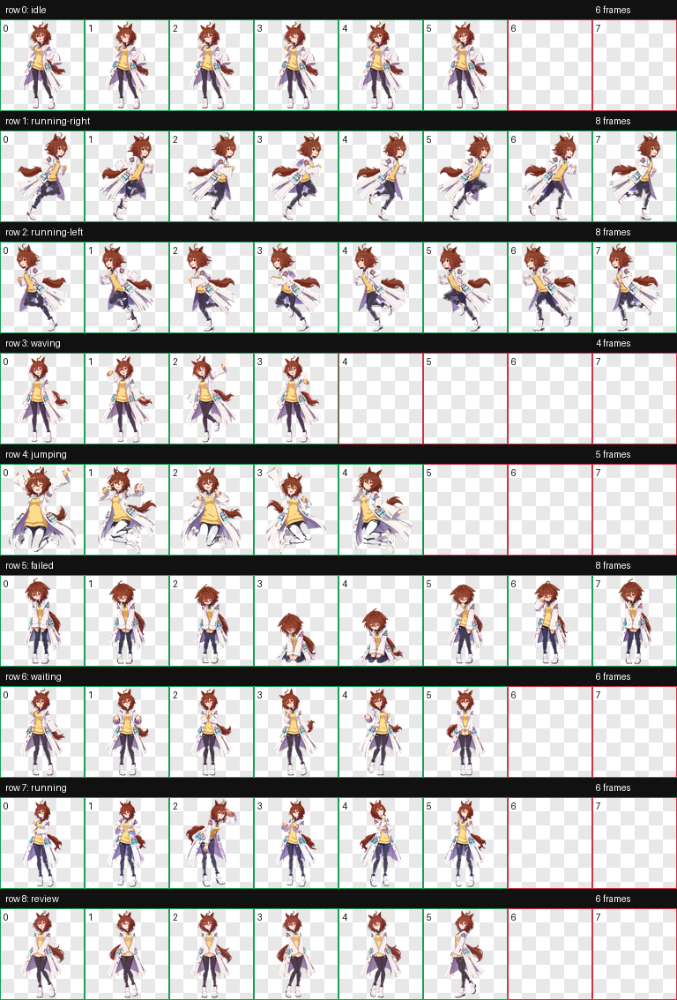

# 爱丽速子实验服 Codex Pet

一只 2D 动漫贴纸风的实验服爱丽速子 Codex pet。角色外观以用户提供的参考图为准：黄色针织内搭、白色实验服的紫灰内衬与长下摆、纽扣、蓝青试管束、栗色耳朵与尾巴。



## 发布内容

- `release/aginesu-lab-coat/`：可安装的宠物包，含 `pet.json` 与 `spritesheet.webp`。
- `assets/contact-sheet.png`：九种标准状态的静态总览。
- `qa/`：图集结构校验、帧检查和九组 GIF 动画预览。
- `references/`：不含原始参考图；其为第三方角色艺术，避免未经确认地随公开仓库再分发。

## 安装

将 `release/aginesu-lab-coat` 整个目录复制到：

```text
%USERPROFILE%\\.codex\\pets\\aginesu-lab-coat
```

重启或刷新 Codex 后，在自定义宠物中选择“爱丽速子实验室”。

## 状态映射

| 行 | 状态 | 帧数 |
| --- | --- | ---: |
| 0 | idle | 6 |
| 1 | running-right | 8 |
| 2 | running-left | 8 |
| 3 | waving | 4 |
| 4 | jumping | 5 |
| 5 | failed | 8 |
| 6 | waiting | 6 |
| 7 | running | 6 |
| 8 | review | 6 |

## 兼容性说明

此仓库归档的是此前九状态 **v1** 图集：`1536 × 1872`（8 × 9 个 `192 × 208` 单元）。它通过随包保存的 v1 结构校验；当前 hatch-pet 规范已改为带 16 个方向观察姿势的 v2 图集（`1536 × 2288`、`spriteVersionNumber: 2`）。

因此，请仅在仍支持 v1 九状态宠物包的 Codex 版本中安装此发布物。若目标版本要求 v2，应重新生成方向行后再发布，不应把当前图集伪装成 v2。
